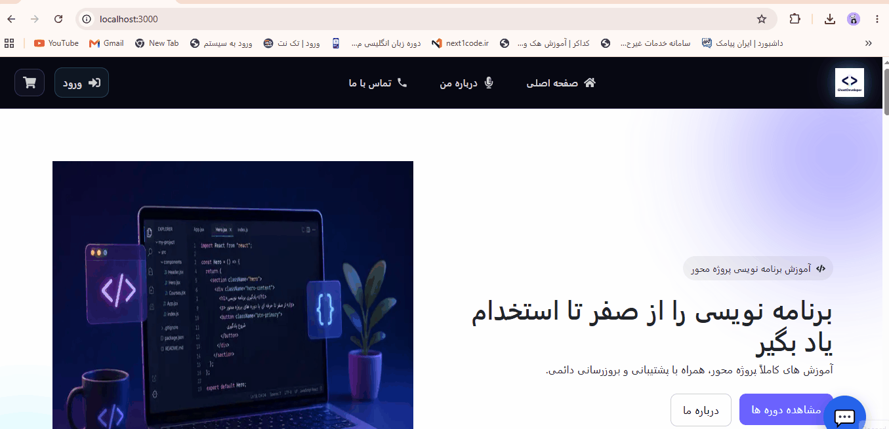
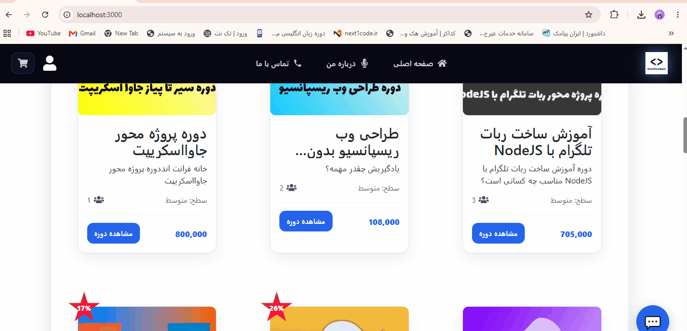
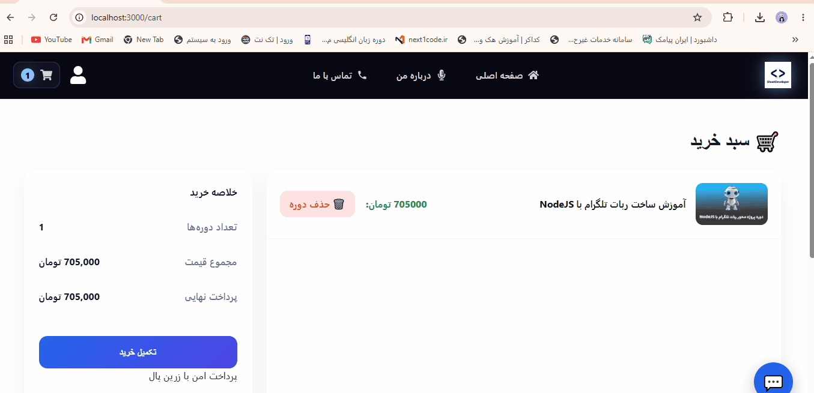

````md
<div align="center">

# 🎓 SaaS Learning Platform

A modern **Full-Stack Online Learning Platform** built with **Next.js**, **React**, **MongoDB**, and **JWT Authentication**.

**Build • Learn • Grow 🚀**


</div>

---

# 📖 Overview

This project is a modern online learning platform developed using the latest JavaScript technologies. It demonstrates a complete real-world full-stack application where users can browse educational courses, purchase them securely, watch course videos, manage their profiles, and interact through comments and reviews.

The platform also includes a powerful administration panel for managing courses, users, comments, orders, and uploaded videos.

---

# 🎯 Main Goals

- Build a scalable Full-Stack web application.
- Implement secure Phone Number OTP authentication.
- Provide a seamless online learning experience.
- Create a complete course purchasing workflow.
- Develop a powerful administration dashboard.
- Deliver a responsive and modern user interface.

---

# ✨ Features

## 👤 Authentication & User Management

- Phone Number OTP Authentication
- JWT Authentication
- Refresh Token Support
- User Profile Management
- Role-based Authorization
- Protected API Routes

## 📚 Course Management

- Browse Available Courses
- Detailed Course Pages
- Course Chapters & Lessons
- Free & Premium Courses
- Discount Support
- Video-based Learning

## 🛒 Shopping Experience

- Shopping Cart
- Add & Remove Courses
- Secure Checkout
- Purchase History
- Order Summary

## 💳 Payment

- ZarinPal Payment Gateway
- Payment Verification
- Callback Handling
- Automatic Enrollment

## 🎥 Video Storage

- Arvan Cloud Object Storage
- Video Upload
- Cloud Media Management

## 💬 Comment System

- Course Reviews
- Comment Approval
- Feedback Management

## 🤖 AI Chat Assistant

- AI-powered Chat Interface
- Authenticated Access
- Responsive User Experience

## ⚙️ Admin Dashboard

- Dashboard Statistics
- Course Management
- User Management
- Order Management
- Comment Management
- Video Upload
- Platform Analytics

## 📱 User Experience

- Fully Responsive Design
- Mobile Friendly
- Modern UI
- Smooth Animations
- Fast Navigation
- Optimized Performance

## 🔒 Security

- Protected API Routes
- JWT Authentication
- Input Validation
- Secure Database Operations
- Environment Variables

## 🚀 Performance

- Next.js App Router
- Server Components
- Optimized Rendering
- Efficient Database Queries

---

# 🎥 Project Preview

## 🏠 Home Page

<p align="center">

</p>

---

## 📖 Course Details

<p align="center">

</p>

---

## 🔐 OTP Authentication

<p align="center">

</p>

---

## 🛒 Shopping Cart

<p align="center">

</p>

---

## 💳 Payment

<p align="center">

</p>

---

## ⚙️ Admin Dashboard

<p align="center">

</p>

---

## 🤖 AI Chat Assistant

<p align="center">

</p>

---

# 🛠 Tech Stack

| Category | Technologies |
|-----------|--------------|
| **Frontend** | Next.js 16, React 19, Bootstrap, CSS Modules |
| **Backend** | Next.js Route Handlers, Node.js |
| **Database** | MongoDB, Mongoose |
| **Authentication** | JWT, OTP |
| **Storage** | Arvan Cloud Object Storage |
| **Payment** | ZarinPal |
| **Tools** | Git, GitHub, VS Code |

---

# 🚀 Installation

Clone the repository

```bash
git clone https://github.com/saeedsani13690/saeedsanideveloper.git

cd saeedsanideveloper

npm install

npm run dev
````

Open your browser and visit:

```text
http://localhost:3000
```

---

# 🔑 Environment Variables

Create a `.env.local` file and add:

```env
MONGO_URL=

JWT_SECRET=

ARVAN_ENDPOINT=

ARVAN_ACCESS_KEY=

ARVAN_SECRET_KEY=

ARVAN_BUCKET=

SMS_API_KEY=

ZARINPAL_MERCHANT_ID=
```

---

# 📂 Folder Structure

```text
app/
components/
configs/
context/
lib/
models/
public/
utils/
```

---

# 🚀 Future Improvements

* 🎓 Course Certificates
* ❤️ Wishlist
* 📧 Email Notifications
* 👨‍🏫 Instructor Dashboard
* 📈 Student Progress Tracking
* 🔍 Advanced Search
* 🌍 Multi-language Support

---

# 👨‍💻 Developer

**Saeed Sani**

Full Stack JavaScript Developer

### Skills

* Next.js
* React
* Node.js
* MongoDB
* Mongoose
* JWT Authentication
* REST API Development

---

# 📄 License

This project is licensed under the MIT License.

```
```
